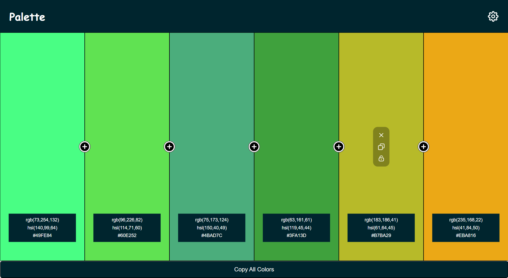

<h1 align="center">Blogr landing page</h1>

  <h3>
    <a href="https://gh0stfreak.github.io/Blogr-landing-page-main/" color="white" target="_blank">
      Live
    </a>
  
  </h3>

 

## About The Project

This HTML, CSS & React website is perfect for any web developer and designer in need of determining a color theme for their website and mockup designs.
  Your users should be able to:
 1. Choose and lock multiple colors in a palette
 2. Copy the palette color's code in RGB, HSL and Hex format

## Built with

- Semantic HTML5 markup
- CSS custom properties
- Flexbox
- Desktop-first workflow
- React
- JSX
